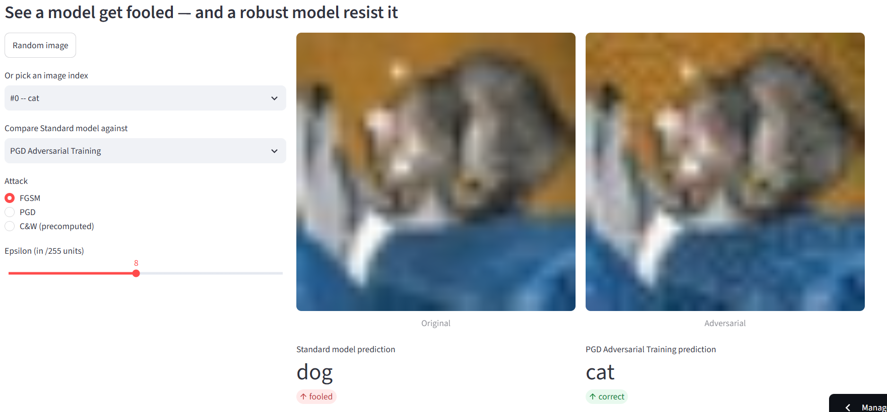
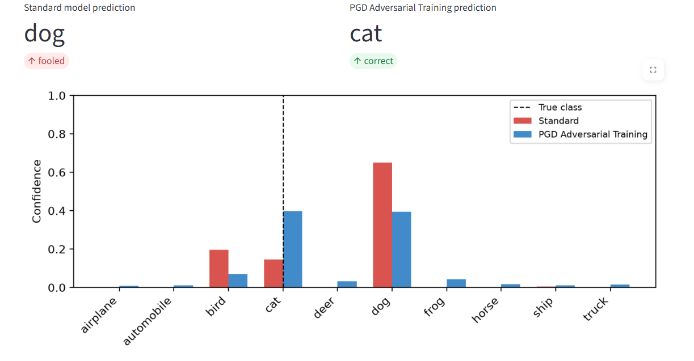

# CIFAR-10 Adversarial Robustness: Empirical & Certified Defenses

A from-scratch adversarial machine learning pipeline on CIFAR-10 -- attacks, empirical defenses, and certified robustness, implemented in raw PyTorch rather than wrapped around an existing adversarial-robustness library. Reproduces Madry et al. 2018 (PGD adversarial training) and Cohen et al. 2019 (randomized smoothing) end to end, plus TRADES, a correctly-tuned C&W L2 attack, and supporting analysis.

**[Live interactive dashboard](https://cifar10-robustness.streamlit.app/)**



*A real FGSM attack (epsilon=8/255) run live against the baseline model: an imperceptible pixel-level perturbation flips the standard model's prediction from cat to dog at 65% confidence, while PGD adversarial training correctly holds onto cat under the identical attack.*

---

## Overview

Most course projects in this space either wrap `torchattacks`/`robustbench` around a model, or reproduce a single paper's headline number. This project instead:

- Implements FGSM, PGD, and a properly binary-searched C&W L2 attack directly against raw gradients -- no attack library
- Trains and benchmarks **two** empirical defenses (PGD-AT and TRADES) so the report can show a robustness/accuracy trade-off curve, not just one data point
- Implements randomized smoothing certification from the Clopper-Pearson bound up, including Average Certified Radius (ACR) and an empirical sanity test that verifies the theoretical bound actually holds against real attacks
- Ships as an interactive dashboard, not just a notebook and a CSV

## Key Results

### Empirical robustness (CIFAR-10, ResNet-18)

| Model | Clean Acc | FGSM Acc | PGD-10 Acc | C&W L2 Acc | C&W Avg L2 Norm |
|---|---|---|---|---|---|
| Baseline (no defense) | 94.38% | 31.72% | 0.02% | 0.00% | 0.1338 |
| PGD Adversarial Training (Madry et al. 2018) | 82.74% | 55.42% | 49.51% | 0.00% | 0.7746 |
| TRADES (Zhang et al. 2019) | 81.88% | 57.18% | 53.03% | 0.00% | 0.8197 |
| Gaussian-Augmented (sigma=0.25) | 73.02% | -- | -- | -- | -- |

The undefended baseline collapses completely under PGD (0.02% accuracy) and is fully broken by C&W (0% accuracy, achieved via 9-step binary search over the attack's trade-off constant -- a naive fixed-constant C&W implementation only fools a small fraction of images and can look deceptively like a robust result). PGD-AT reproduces Madry et al.'s published numbers within ~2%. TRADES trades a small amount of clean accuracy for a meaningfully higher PGD-10 accuracy than PGD-AT, consistent with the trade-off the TRADES paper reports.

C&W drives all three models to 0% accuracy, which is expected rather than a sign the defenses failed: unlike FGSM/PGD, C&W has no fixed perturbation budget -- it keeps optimizing until it finds *any* successful perturbation, however large, so 0% was always the eventual outcome regardless of defense. The metric that actually shows the defenses working is the perturbation size required to get there: baseline needed an average L2 norm of just 0.1338, while PGD-AT and TRADES required 0.7746 and 0.8197 respectively -- roughly **6x more perturbation** to fool the defended models under an attack with no epsilon constraint.

### Certified robustness (randomized smoothing, Cohen et al. 2019)

- **250 images certified**, N0=100 / N=10,000 Monte Carlo samples per image, alpha=0.001 (99.9% confidence), sigma=0.25
- **208/250 (83.2%)** correctly classified and certified
- **Average Certified Radius (ACR): 0.4263**
- **Sanity test**: real C&W adversarial perturbations, scaled to 95% of each image's certified radius, were tested against 50 certified images -- the certified bound held in **50/50 (100%)** cases, confirming the theoretical guarantee empirically rather than relying on the math alone

One result worth flagging explicitly rather than treating as an anomaly: the smoothed/certified accuracy (83.2%) is *higher* than the model's raw clean accuracy with no noise (73.02%). This is a documented effect of Gaussian-augmented training -- the model's decision boundaries are calibrated for noisy inputs, so a single clean forward pass is mildly out-of-distribution for it relative to the noise-averaged smoothed prediction.

See `certified_accuracy_curve.png` for the full certified-accuracy-vs-radius curve.

### Supporting analysis

- **Transferability matrix** -- white-box vs. black-box attack success between ResNet-18 and a MobileNetV2 substitute model (`transferability_matrix.csv`)
- **Loss landscape comparison** -- 2D loss surface around a test image for the standard vs. PGD-AT model, visualizing the "steep cliff vs. flat plateau" effect of adversarial training (`loss_landscape_comparison.png`)

## Repo Structure

```
adversarial-attack-defense/
├── attacks/                    # FGSM, PGD (whitebox.py)
├── defenses/                   # TRADES loss and training
├── models/                     # ResNet-18 classifier for CIFAR-10
├── utils/                      # Dataloaders, checkpointing
├── dashboard/
│   ├── app.py                  # Streamlit dashboard (4 tabs)
│   ├── requirements.txt
│   └── assets/                 # Checkpoints, CSVs, PNGs, precomputed C&W gallery
├── scripts/
│   ├── export_demo_images.py   # One-time: bundle a CIFAR-10 subset for the dashboard
│   └── generate_cw_gallery.py  # One-time: precompute C&W examples for the dashboard
├── adv-defense-runner-ipynb.ipynb   # Main Kaggle notebook -- the full pipeline
├── empirical_benchmarks.csv
├── certification_radii.csv
├── acr_summary.csv
├── sanity_test_scaled.csv
├── transferability_matrix.csv
├── certified_accuracy_curve.png
├── loss_landscape_comparison.png
└── requirements.txt
```

## Dashboard

The dashboard (`dashboard/app.py`, Streamlit) turns the static results above into something interactive:

1. **Attack Demo** -- pick a CIFAR-10 image, run FGSM or PGD live against the baseline model with an adjustable epsilon slider, and watch the standard model get fooled while a chosen robust model (PGD-AT or TRADES) resists. C&W results are precomputed rather than run live, since binary-search C&W is too slow for CPU-only free hosting.

   

   *Per-class softmax confidence for both models on the same adversarial input -- the standard model isn't just wrong, it's confidently wrong (65% dog), while PGD-AT stays anchored on the true class.*

2. **Benchmark Leaderboard** -- the results table above, sortable.
3. **Certified Robustness** -- the certified-accuracy curve, ACR, and sanity-test pass rate as metric cards.
4. **Under the Hood** -- the loss landscape comparison and a transferability heatmap.

## Reproducing

The full pipeline runs in `adv-defense-runner-ipynb.ipynb` on Kaggle (GPU required for training; a P100/T4-class GPU is sufficient). Rough order:

1. Clone the repo and install `requirements.txt`
2. Train the baseline model (50 epochs) and evaluate against FGSM/PGD
3. Train PGD-AT (50 epochs) and TRADES (50 epochs), evaluate both the same way
4. Train the Gaussian-augmented model (30 epochs, sigma=0.25) and run the certification loop (250 images, N=10,000)
5. Run the binary-search C&W attack and the certification sanity test
6. (Optional) Transferability matrix and loss landscape cells
7. Export `scripts/export_demo_images.py` and `scripts/generate_cw_gallery.py` outputs for the dashboard

Checkpoints and CSVs referenced above are already committed to this repo, so the dashboard runs out of the box without retraining anything.

## References

*I don't have search access while writing this, so please verify these citations independently before relying on them.*

- Madry, A., Makelov, A., Schmidt, L., Tsipras, D., & Vladu, A. (2018). *Towards Deep Learning Models Resistant to Adversarial Attacks.* ICLR.
- Cohen, J., Rosenfeld, E., & Kolter, Z. (2019). *Certified Adversarial Robustness via Randomized Smoothing.* ICML.
- Zhang, H., Yu, Y., Jiao, J., Xing, E., El Ghaoui, L., & Jordan, M. (2019). *Theoretically Principled Trade-off between Robustness and Accuracy.* ICML. (TRADES)
- Carlini, N., & Wagner, D. (2017). *Towards Evaluating the Robustness of Neural Networks.* IEEE S&P. (C&W attack)

## Team

Amit Khedar, Harsh Birda, Harshal Hadke, Harshit Yadav

## License

MIT
